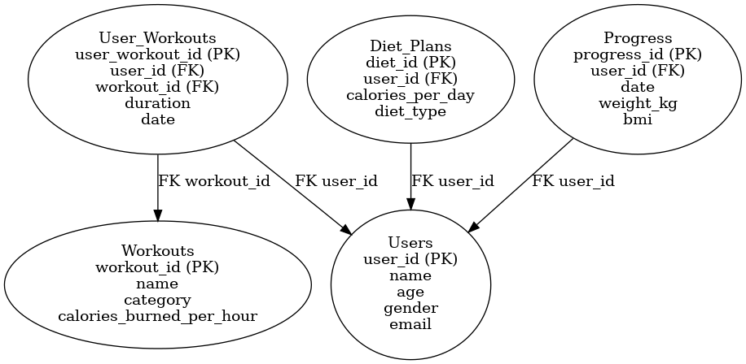

# 💓 Health Tracker Dashboard

A simple and effective dashboard that helps users track their health data like workouts, diet, and body progress — built to show real-time insights using SQL and Power BI / Tableau.

---

## 🌟 Features

- Track daily workouts and calories burned
- Manage personalized diet plans
- Monitor weight, BMI, and fitness progress
- Clean database structure with relational design
- Insightful dashboards to visualize your health journey

---

## 🧠 Tech Stack

- **SQL**: For managing and querying data
- **Power BI / Tableau**: For data visualization
- **Excel**: For preprocessing and cleaning
- **ER Diagram**: Designed to support analytical goals

---

## 🧱 Database Tables

### 👤 1. Users
Each user has basic info like name, age, gender, and email.

| Field | Type |
|-------|------|
| user_id | Primary Key |
| name | Text |
| age | Integer |
| gender | Text |
| email | Text |

---

### 🏃‍♀️ 2. Workouts
A list of different workouts along with categories and calories burned per hour.

| Field | Type |
|-------|------|
| workout_id | Primary Key |
| name | Text |
| category | Text (e.g., Cardio, Strength) |
| calories_burned_per_hour | Integer |

---

### 🧾 3. User_Workouts
Tracks which user did which workout, for how long, and on which date.

| Field | Type |
|-------|------|
| user_workout_id | Primary Key |
| user_id | Foreign Key (Users) |
| workout_id | Foreign Key (Workouts) |
| duration | Minutes |
| date | Date |

---

### 🥗 4. Diet_Plans
Each user can have a diet plan with their daily calories and diet type.

| Field | Type |
|-------|------|
| diet_id | Primary Key |
| user_id | Foreign Key (Users) |
| calories_per_day | Integer |
| diet_type | Text (e.g., Keto, Vegan) |

---

### 📈 5. Progress
Tracks how a user is progressing — like their weight and BMI over time.

| Field | Type |
|-------|------|
| progress_id | Primary Key |
| user_id | Foreign Key (Users) |
| date | Date |
| weight_kg | Decimal |
| bmi | Decimal |

---

## 📊 ER Diagram

Here’s the ER Diagram for the Health Tracker Project:

---

## 🙌 Credits

Made with curiosity and care by **Alka Mittal**  
Health meets data, and dashboards make it beautiful 🌿

